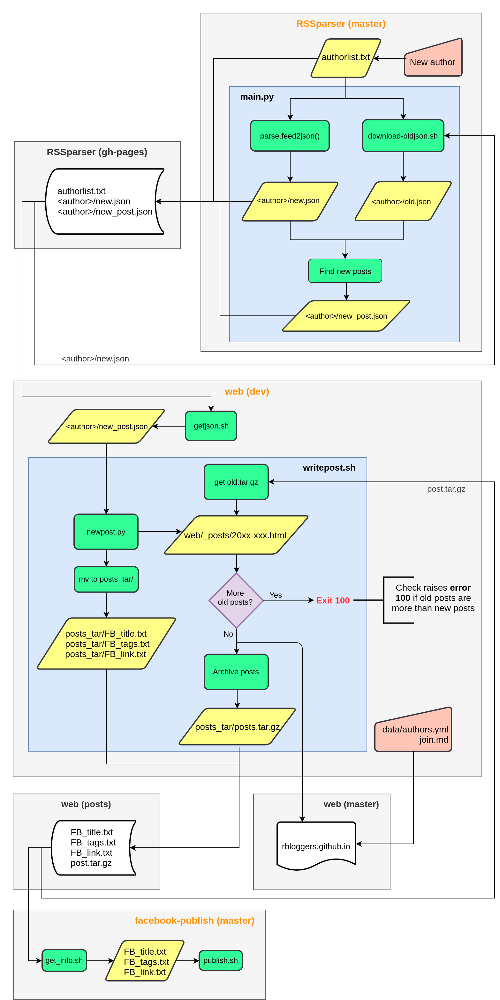

# R 部落客

## 加入新成員

### 更新資料
1. RSSparser
    - `authorlist.txt`
        - 1st column: directory name
        - 2nd column: **must match fields in  `Rbloggers.github.io/web/_data/authors.yml`**
1. `_data/authors.yml`
    - New field (match 2nd column in `RSSparser/authorlist.txt`)
1. `join.md` > `author: ['<new field name of _data/authors.yml>']`

### [測試](./test)

### 清除舊文章 (`old.tar.gz`)

- comment out 14 in `write_post.sh`:
    - `cp -r _posts/* web/_posts/`

## 專案運作流程

